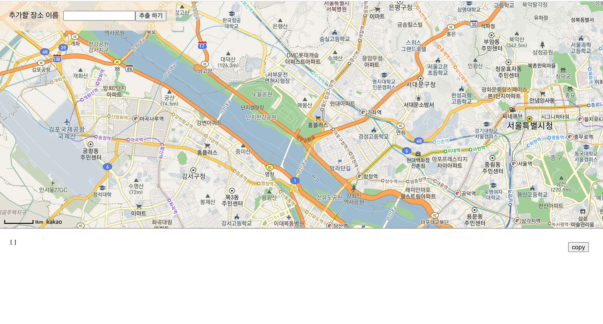
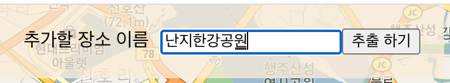
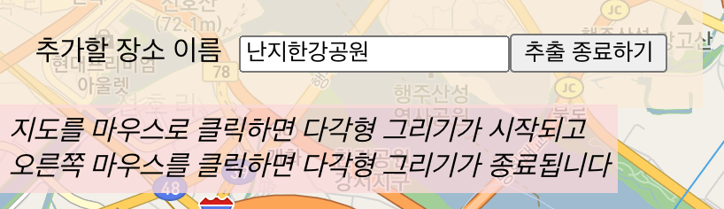
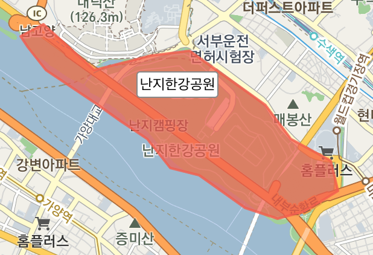
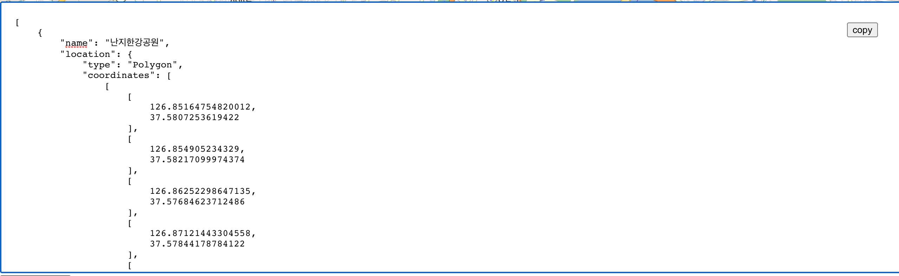

# GeoJSON Polygon Generator

본 사이트는 geoJson Polygon 타입의 데이터를 지도로 간편하게 생성할 수 있는 웹 사이트입니다.


## Demo

https://ha-young.github.io/GeoJsonPolygonGenerator/


## Data Structure

### 생성되는 데이터 형태

```
Array<MyGeoJSON_Polygon>
```

##### MyGeoJSON_Polygon

```
{
  "name" : STRING,
  "location" : GeoJSON (Polygon)
}
```

##### GeoJSON (Polygon)

```
{
  "type": "Polygon",
  "coordinates": [
    [
      [
        126.85164754820012,
        37.5807253619422
      ],
      [
        126.854905234329,
        37.58217099974374
      ],
      ...
    ]
  ]
}
```

### Example

```
[
	{
		"name": "my custom area name1",
		"location": {
			"type": "Polygon",
			"coordinates": [
        [
          [
            126.85164754820012,
            37.5807253619422
          ],
          [
            126.854905234329,
            37.58217099974374
          ],
          ...
        ]
      ]
		}
	},
	{
		"name": "my custom area name2",
		"location": {
			"type": "Polygon",
			"coordinates": [
        [
          [
            126.85164754820012,
            37.5807253619422
          ],
          [
            126.854905234329,
            37.58217099974374
          ],
          ...
        ]
      ]
		}
	},
	...
]
```


## Usage

1. **화면**



2. **추가하기**

   1. 좌측 상단 추가할 장소 이름 입력

      

   2. 추출하기 클릭

      

   3. 지도에 마우스 클릭하여 원하는 지역에 Polygon을 그린 후 오른쪽 마우스 클릭

      

3. **데이터 복사**

   1. 아래 생성된 GeoJSON 데이터 형태 (배열) 복사하여 사용

   

   